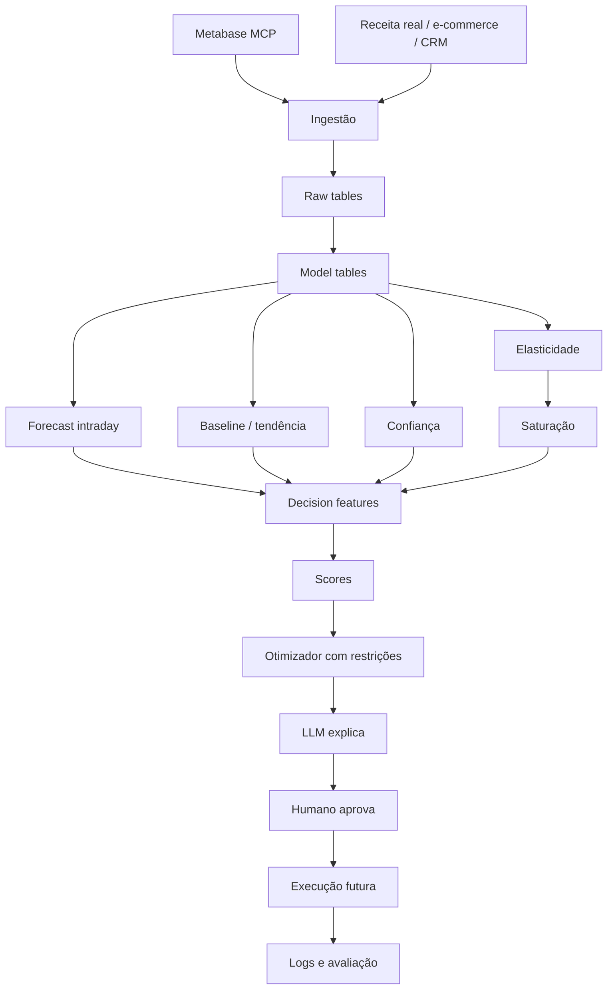
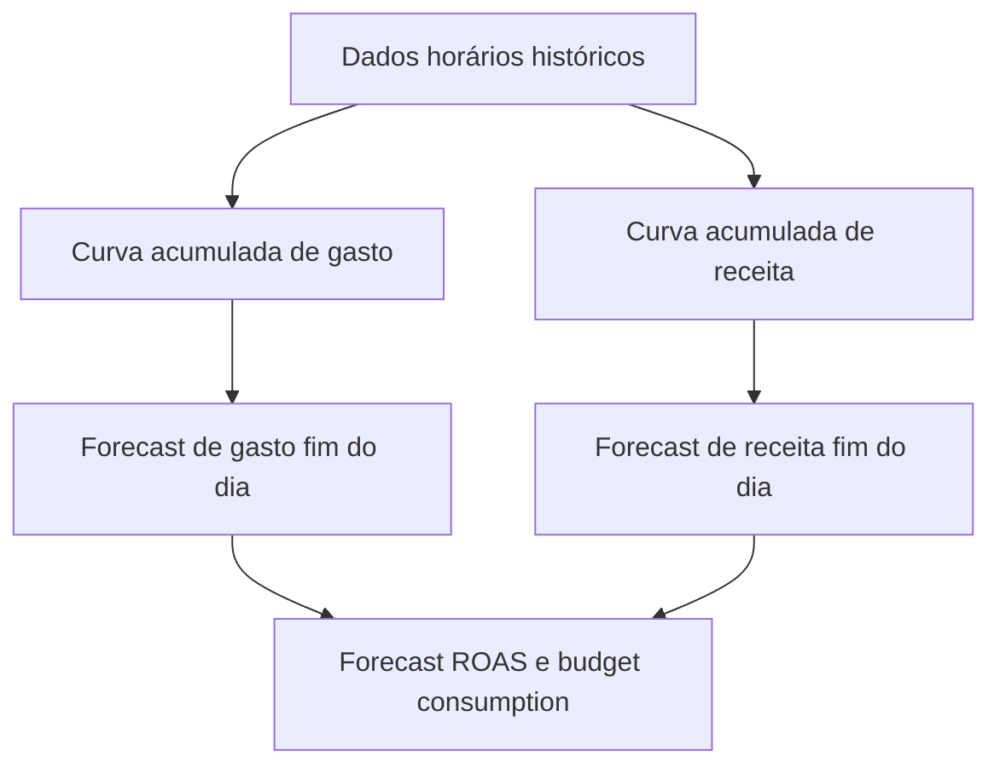
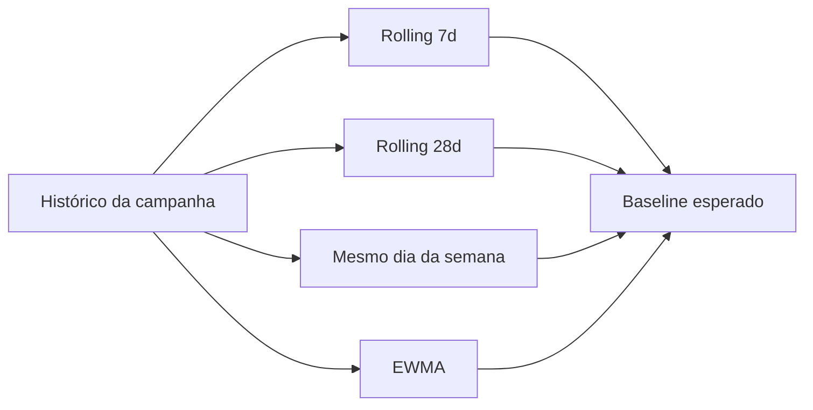
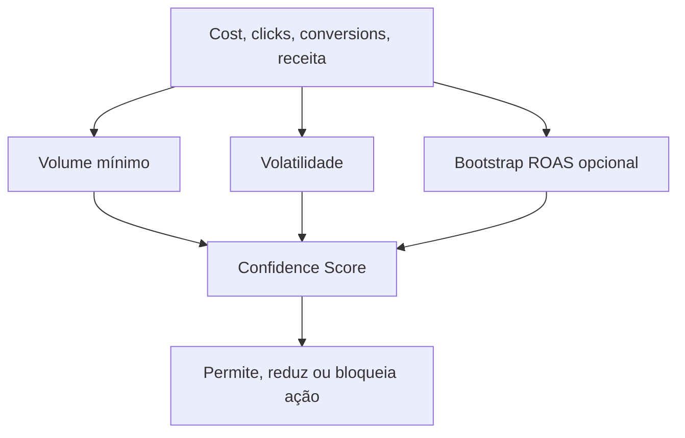
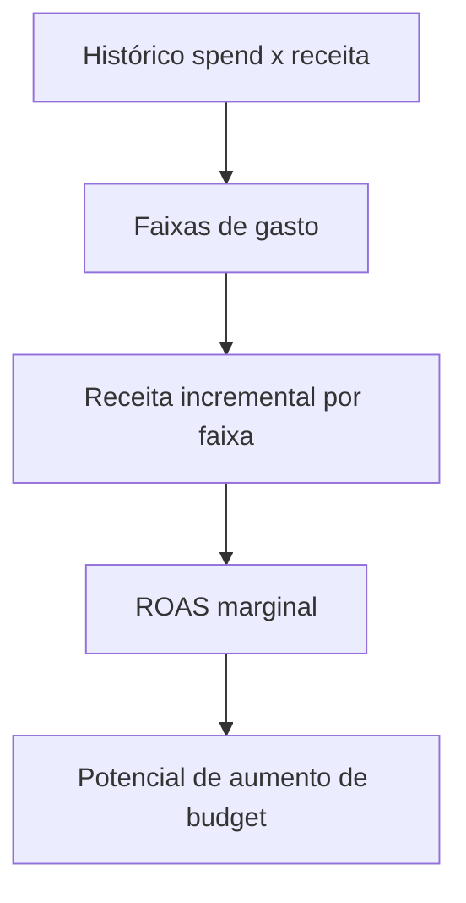
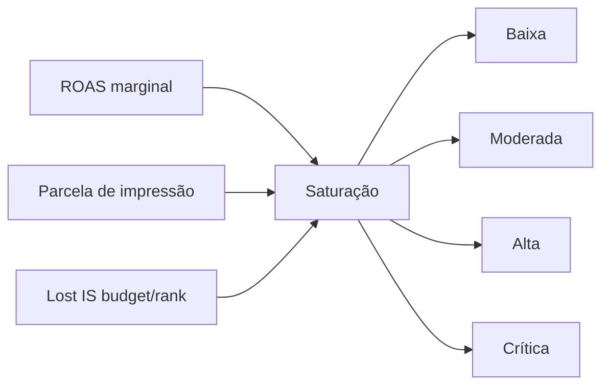
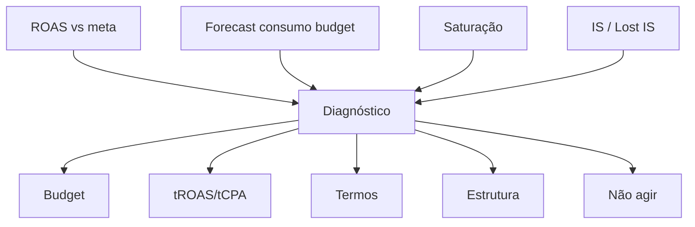
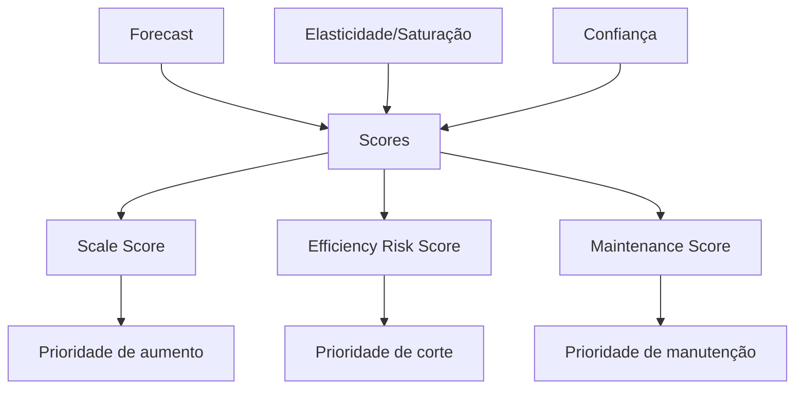
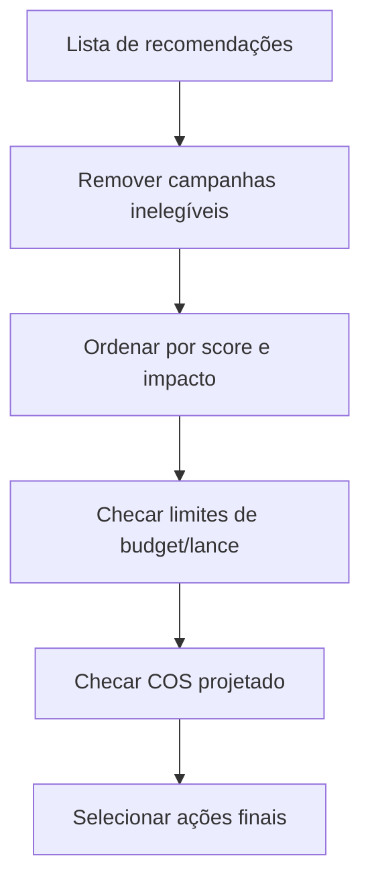
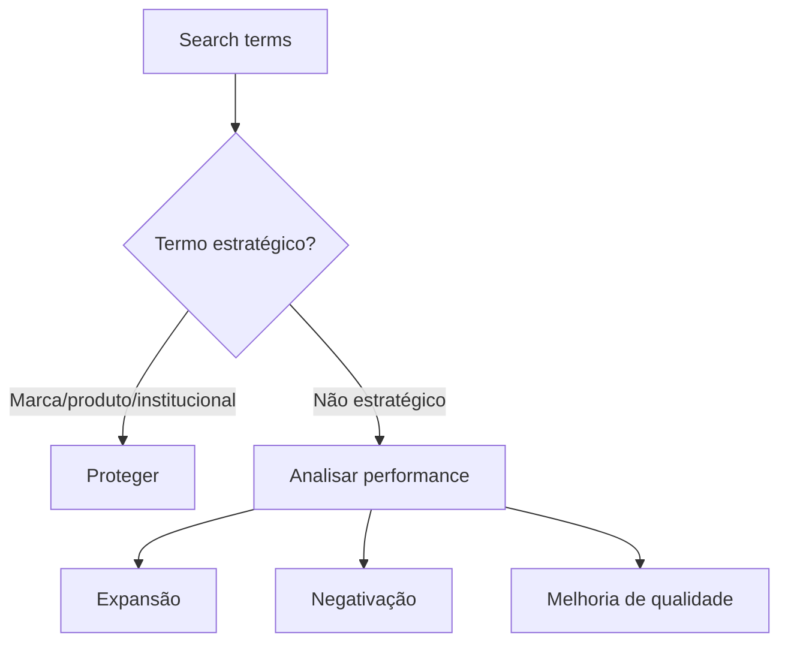

Abaixo está um prompt completo para você salvar como `.md` e usar no Claude/Codex. Ele já considera que a fonte principal será o **MCP do Metabase**, usando a tabela:

```text
Data Mart - raw - Gogroup Google Ads
```

---

````markdown
# GoTrends v2 — Prompt Mestre para Claude/Codex

Você atuará como agente técnico/engenheiro de dados e modelagem estatística no projeto **GoTrends v2**.

## 1. Contexto do projeto

O GoTrends v2 será um sistema de apoio à decisão para otimização de campanhas de Google Ads da empresa Ápice/GoGroup.

A ideia é criar um sistema parecido com um “Plaison para Google Ads”: um agente que analisa campanhas, identifica oportunidades de otimização e recomenda ações como:

- aumento/redução de orçamento;
- ajuste de tROAS/tCPA;
- identificação de campanhas saturadas;
- priorização de campanhas com maior retorno marginal;
- sugestões para expansão, negativação e melhoria de termos de pesquisa;
- geração de explicações claras para humanos aprovarem a ação.

Neste momento, **não devemos conectar diretamente à Google Ads API**. A fonte inicial de dados será o **MCP do Metabase**, consultando a tabela:

```text
Data Mart - raw - Gogroup Google Ads
````

A prioridade é construir primeiro a camada analítica/modelagem e só depois pensar em execução automática via Google Ads API.

---

## 2. Visão macro da arquitetura

Seguir a arquitetura abaixo como referência conceitual:



O objetivo central é:

> O agente não deve decidir com base em ROAS médio puro.
> Ele deve decidir com base em forecast intraday, retorno marginal esperado, saturação, confiança estatística e restrições de negócio.

---

## 3. Princípio central do projeto

A LLM não deve ser responsável por “inventar” a decisão.

A LLM deve receber outputs estruturados dos modelos estatísticos e apenas:

* explicar a recomendação;
* organizar o raciocínio;
* apresentar riscos;
* indicar confiança;
* sugerir ação para aprovação humana.

A decisão deve ser calculada por uma camada determinística/estatística.

A frase-guia do projeto é:

```text
Decisão = Elegibilidade da regra de negócio
         × Impacto incremental esperado
         × ROAS marginal
         × Penalidade de saturação
         × Confiança estatística
         × Restrições globais de COS/budget
```

---

# 4. Dados principais

A tabela base a consultar via MCP do Metabase é:

```text
Data Mart - raw - Gogroup Google Ads
```

Primeira tarefa técnica: inspecionar essa tabela e mapear quais colunas existem.

## 4.1 Objetivo da inspeção inicial

Identificar se a tabela contém, ou permite derivar, os seguintes campos:

```text
date
hour
campaign_id
campaign_name
campaign_type
ad_group_id
ad_group_name
search_term
keyword
cost
impressions
clicks
conversions
conversion_value
revenue
budget
target_roas
target_cpa
impression_share
lost_is_budget
lost_is_rank
status
bidding_strategy
```

Caso algum campo não exista, registrar:

* nome esperado;
* nome real encontrado;
* se pode ser derivado;
* se precisa de outra tabela;
* impacto da ausência desse dado no modelo.

---

# 5. Tabelas/modelos intermediários desejados

Criar lógica para materializar ou simular as seguintes camadas.

## 5.1 `campaign_daily_metrics`

Uma visão diária por campanha.

Campos desejados:

```text
date
campaign_id
campaign_name
campaign_type
cost
impressions
clicks
conversions
conversion_value
revenue_real
budget
target_roas
target_cpa
impression_share
lost_is_budget
lost_is_rank
ctr
cpc
cvr
roas
budget_consumption
```

Derivações:

```text
ctr = clicks / impressions
cpc = cost / clicks
cvr = conversions / clicks
roas = conversion_value / cost
budget_consumption = cost / budget
```

Tratar divisão por zero.

---

## 5.2 `campaign_hourly_metrics`

Uma visão horária por campanha.

Campos desejados:

```text
date
hour
campaign_id
campaign_name
campaign_type
cost
impressions
clicks
conversions
conversion_value
revenue_real
```

Essa tabela será usada no modelo de forecast intraday.

---

## 5.3 `campaign_model_features`

Tabela final de features de decisão por campanha/hora/dia.

Campos desejados:

```text
date
hour
campaign_id
campaign_name
campaign_type

forecast_cost_eod
forecast_revenue_eod
forecast_roas_eod
forecast_budget_consumption

roas_7d
roas_14d
roas_28d
same_weekday_roas
trend_status

data_sufficiency
confidence_score

marginal_roas
elasticity
saturation_level
recommended_spend_band_min
recommended_spend_band_max

scale_score
efficiency_risk_score
maintenance_score

recommended_action
recommended_change_pct
risk_level
reason
```

---

## 5.4 `campaign_recommendations`

Tabela final de recomendações.

Campos desejados:

```text
timestamp
date
hour
campaign_id
campaign_name
recommended_action
change_percent
expected_incremental_cost
expected_incremental_revenue
expected_marginal_roas
projected_cos
confidence_score
risk_level
reason
business_constraints_status
approval_status
execution_status
```

---

## 5.5 `agent_decision_log`

Tabela de auditoria.

Campos desejados:

```text
timestamp
campaign_id
input_snapshot
model_outputs
llm_explanation
recommended_action
approved_by
approved_at
executed
execution_timestamp
result_after_24h
result_after_72h
notes
```

---

# 6. Modelos a implementar

Implementar os modelos abaixo em ordem. Manter tudo simples, auditável e incremental.

---

# Modelo 1 — Forecast Intraday

## Pergunta que responde

> Com base no que aconteceu até agora, como a campanha deve fechar o dia?

## Por que existe

O projeto quer tomar decisões durante o dia. Portanto, não podemos olhar ROAS ou gasto intraday cru, porque campanhas têm curvas horárias diferentes.

Uma campanha pode gastar cedo e converter tarde. Outra pode converter cedo e gastar depois.

## Dados necessários

```text
date
hour
campaign_id
campaign_type
cost
conversion_value ou revenue
budget
```

## Método MVP

Calcular a curva histórica de acúmulo por:

```text
campaign_id + weekday + hour
```

Se houver pouco volume por campanha, usar fallback:

```text
campaign_type + weekday + hour
```

Ou, se ainda assim houver pouco volume:

```text
weekday + hour
```

Para cada hora, calcular:

```text
pct_cost_until_hour = cost_acumulado_ate_hora / cost_total_dia
pct_revenue_until_hour = revenue_acumulada_ate_hora / revenue_total_dia
```

Então:

```text
forecast_cost_eod = cost_so_far / pct_cost_until_hour
forecast_revenue_eod = revenue_so_far / pct_revenue_until_hour
forecast_roas_eod = forecast_revenue_eod / forecast_cost_eod
forecast_budget_consumption = forecast_cost_eod / budget
```

## Cuidados

* Tratar dias com cost_total_dia = 0.
* Não usar a data atual para construir a curva histórica.
* Usar janela histórica configurável, por exemplo últimos 30, 60 ou 90 dias.
* Criar fallback quando a campanha não tiver histórico suficiente.
* Criar `confidence` do forecast com base em volume histórico.

## Output esperado

```json
{
  "campaign_id": "123",
  "hour": 12,
  "forecast_cost_eod": 10000,
  "forecast_revenue_eod": 20000,
  "forecast_roas_eod": 2.0,
  "forecast_budget_consumption": 1.08,
  "confidence": "medium"
}
```

## Diagrama



---

# Modelo 2 — Baseline e Tendência

## Pergunta que responde

> A campanha está melhorando, piorando ou dentro do comportamento normal?

## Por que existe

Google Ads tem muita variação diária. Não podemos comparar apenas hoje contra ontem.

Precisamos comparar contra:

* média recente;
* mesmo dia da semana;
* tendência suavizada.

## O que implementar

Calcular por campanha:

```text
roas_7d
roas_14d
roas_28d
cost_7d
cost_28d
conversion_value_7d
conversion_value_28d
same_weekday_roas_avg
ewma_roas
```

EWMA:

```text
ewma_today = alpha * roas_today + (1 - alpha) * ewma_yesterday
```

Usar alpha inicial entre 0.3 e 0.5.

## Classificação simples

Criar `trend_status`:

```text
strong_positive
positive
normal
negative
strong_negative
```

Regra inicial possível:

```text
se roas_forecast_today > roas_28d * 1.2 => positive
se roas_forecast_today < roas_28d * 0.8 => negative
senão normal
```

Depois podemos sofisticar.

## Output esperado

```json
{
  "campaign_id": "123",
  "forecast_roas_eod": 2.1,
  "roas_7d": 2.4,
  "roas_28d": 2.8,
  "same_weekday_roas": 2.0,
  "trend_status": "normal"
}
```

## Diagrama



---

# Modelo 3 — Confiança Estatística

## Pergunta que responde

> Temos dados suficientes para confiar nessa recomendação?

## Por que existe

Campanhas com pouco dado podem parecer muito boas ou muito ruins por sorte.

Exemplo:

```text
Campanha A: R$ 50.000 gastos, ROAS 3.2
Campanha B: R$ 300 gastos, ROAS 8.5
```

A campanha B não necessariamente deve receber verba.

## O que implementar no MVP

Criar um `confidence_score` de 0 a 100 usando critérios simples:

```text
cost_lookback
clicks_lookback
conversions_lookback
days_with_spend
variance_roas
```

Exemplo de heurística inicial:

```text
+25 pontos se cost_28d >= limiar mínimo
+25 pontos se clicks_28d >= limiar mínimo
+25 pontos se conversions_28d >= limiar mínimo
+25 pontos se days_with_spend >= limiar mínimo
- penalidade se ROAS for muito volátil
```

Depois, se houver tempo, implementar bootstrap para ROAS.

## Bootstrap de ROAS

Reamostrar dias históricos da campanha e calcular distribuição de ROAS.

Output desejado:

```text
roas_p10
roas_p50
roas_p90
prob_roas_above_target
```

## Para CTR/CVR

Opcionalmente usar Binomial/Beta-Binomial:

```text
clicks ~ Binomial(impressions, CTR)
conversions ~ Binomial(clicks, CVR)
```

## Regra prática

Aumentos de budget só devem ser permitidos se:

```text
confidence_score >= 60
```

Ações agressivas só se:

```text
confidence_score >= 75
```

## Output esperado

```json
{
  "campaign_id": "123",
  "data_sufficiency": "high",
  "confidence_score": 78,
  "prob_roas_above_target": 0.72
}
```

## Diagrama



---

# Modelo 4 — Elasticidade Marginal

## Pergunta que responde

> Se aumentarmos o orçamento, qual retorno incremental esperamos?

## Por que existe

ROAS médio olha o passado.

O agente precisa saber se o próximo real investido ainda vale a pena.

```text
ROAS médio = receita total / custo total
ROAS marginal = receita incremental / custo incremental
```

## MVP recomendado

Começar com faixas de gasto diário por campanha.

Exemplo:

```text
Faixa 1: R$ 0–500
Faixa 2: R$ 500–1000
Faixa 3: R$ 1000–1500
Faixa 4: R$ 1500–2000
```

Para cada faixa:

```text
receita média
gasto médio
receita incremental
gasto incremental
marginal_roas
```

## Fallback

Se a campanha não tiver volume suficiente, calcular por:

```text
campaign_type
```

ou cluster de campanhas similares.

## Modelo posterior

Implementar log-log quando houver dados suficientes:

```text
log(revenue) = alpha + beta * log(cost)
```

Onde:

```text
beta = elasticidade
```

Interpretação:

```text
beta = 0.8 => +10% gasto tende a gerar +8% receita
beta = 0.3 => campanha responde pouco ao aumento de verba
```

## Output esperado

```json
{
  "campaign_id": "123",
  "avg_roas": 4.2,
  "marginal_roas": 2.7,
  "elasticity": 0.74,
  "recommended_spend_band_min": 1800,
  "recommended_spend_band_max": 2200
}
```

## Diagrama



---

# Modelo 5 — Saturação e Platô

## Pergunta que responde

> A campanha ainda tem espaço de escala ou já chegou perto do limite?

## Por que existe

Uma campanha pode ter ROAS médio alto e mesmo assim estar saturada.

O agente deve diferenciar:

```text
campanha boa e escalável
campanha boa mas saturada
campanha ruim e saturada
campanha ruim mas com oportunidade estrutural
```

## MVP recomendado

Criar `saturation_level` usando:

```text
marginal_roas
elasticity
impression_share
lost_is_budget
lost_is_rank
forecast_budget_consumption
```

Classificação inicial:

```text
low
moderate
high
critical
```

## Regra inicial sugerida

```text
Se marginal_roas >= meta_roas e impression_share < 80%:
    saturation_level = low

Se marginal_roas >= meta_roas e impression_share entre 80% e 90%:
    saturation_level = moderate

Se impression_share >= 90%:
    saturation_level = high

Se marginal_roas < meta_roas:
    saturation_level = critical
```

Ajustar conforme dados reais.

## Observação importante

Não usar a regra:

```text
IS > 90% => não fazer nada
```

Melhor usar:

```text
IS > 90% => bloquear aumento de budget puro,
            mas permitir ações de eficiência,
            melhoria de qualidade,
            expansão estrutural ou ajuste de tROAS.
```

## Modelo posterior

Se houver volume, testar Michaelis-Menten:

```text
revenue = Vmax * spend / (Km + spend)
```

Esse modelo estima um platô de receita.

## Output esperado

```json
{
  "campaign_id": "123",
  "saturation_level": "high",
  "current_spend": 2300,
  "estimated_plateau_spend": 2500,
  "marginal_roas": 1.2,
  "recommendation": "do_not_increase_budget"
}
```

## Diagrama



---

# Modelo 6 — Diagnóstico da Alavanca

## Pergunta que responde

> O melhor ajuste é em orçamento, tROAS/tCPA, termos, estrutura ou nada?

## Por que existe

Budget e tROAS/tCPA são alavancas diferentes.

Budget responde:

```text
Tenho verba suficiente para capturar demanda?
```

tROAS/tCPA responde:

```text
O algoritmo está restritivo ou permissivo demais?
```

## Matriz inicial

| Cenário                                     | Diagnóstico                        | Ação                                     |
| ------------------------------------------- | ---------------------------------- | ---------------------------------------- |
| ROAS bom + consome budget + baixa saturação | Limitada por orçamento             | Aumentar budget                          |
| ROAS bom + não consome budget               | Target restritivo ou baixa demanda | Reduzir tROAS com cautela                |
| ROAS ruim + consome budget                  | Gastando mal                       | Aumentar tROAS ou reduzir budget         |
| ROAS ruim + não consome budget              | Sem tração                         | Revisar termos/estrutura                 |
| ROAS bom + IS > 90%                         | Saturada                           | Não aumentar budget; otimizar eficiência |
| CTR bom + CVR ruim                          | Problema pós-clique                | Revisar PDP/landing/oferta               |
| CTR ruim + impressão alta                   | Baixa relevância                   | Revisar anúncio/termos                   |

## Output esperado

```json
{
  "campaign_id": "123",
  "primary_constraint": "budget_limited",
  "best_lever": "increase_budget",
  "avoid_lever": "decrease_troas"
}
```

## Diagrama



---

# Modelo 7 — Scores de Campanha

## Pergunta que responde

> Quais campanhas devem ser priorizadas?

Como existem limites de mudanças por dia, precisamos ranquear campanhas.

Criar três scores:

```text
scale_score
efficiency_risk_score
maintenance_score
```

---

## 7.1 Scale Score

Serve para priorizar aumento de orçamento.

Fórmula inicial:

```text
scale_score =
0.30 * marginal_roas_score
+ 0.25 * opportunity_score
+ 0.20 * budget_limitation_score
+ 0.15 * confidence_score
+ 0.10 * stability_score
```

Onde:

```text
marginal_roas_score = normalização do ROAS marginal contra meta
opportunity_score = oportunidade por impression share/lost IS budget
budget_limitation_score = forecast_budget_consumption
confidence_score = confiança estatística
stability_score = baixa volatilidade recente
```

---

## 7.2 Efficiency Risk Score

Serve para priorizar redução de budget ou aperto de tROAS/tCPA.

Fórmula inicial:

```text
efficiency_risk_score =
0.35 * roas_below_target_score
+ 0.25 * wasted_spend_score
+ 0.20 * negative_trend_score
+ 0.10 * saturation_score
+ 0.10 * confidence_score
```

---

## 7.3 Maintenance Score

Serve para identificar campanhas que precisam de manutenção estrutural.

Usar sinais como:

```text
termos ruins
CTR baixo
CPC alto
CVR ruim
Quality Score ruim, se existir
IS perdido por rank
```

Esse score não necessariamente muda budget. Ele gera tarefa.

Exemplos de tarefas:

```text
criar adgroup
negativar termo
melhorar PDP
separar campanha institucional
revisar correspondência
melhorar anúncios
```

## Output esperado

```json
{
  "campaign_id": "123",
  "scale_score": 82,
  "efficiency_risk_score": 22,
  "maintenance_score": 61,
  "recommended_action": "increase_budget"
}
```

## Diagrama



---

# Modelo 8 — Otimizador com Restrições

## Pergunta que responde

> Dadas todas as regras do negócio, quais ações podem ser recomendadas hoje?

## Por que existe

A decisão não é campanha por campanha isoladamente.

Existem restrições globais.

## Restrições de negócio

Implementar os seguintes guardrails:

```text
máximo 3 mudanças de orçamento por dia
máximo 1 mudança de lance por dia
mudança de lance até ±20%
soma das mudanças de orçamento até 40% do investimento inicial do dia
não alterar campanhas bloqueadas manualmente
não alterar campanhas em aprendizado
não alterar campanhas de teste
COS máximo de 15%
```

## MVP

Começar com ranking + filtros:

```text
1. Remover campanhas inelegíveis.
2. Ordenar recomendações por score e impacto esperado.
3. Aplicar ações até bater limites.
4. Checar COS projetado.
5. Retornar lista final de recomendações.
```

## Diagrama



## Output esperado

```json
{
  "selected_actions": [
    {
      "campaign_id": "123",
      "action": "increase_budget",
      "change": 0.12
    },
    {
      "campaign_id": "456",
      "action": "increase_troas",
      "change": 0.15
    }
  ],
  "daily_budget_change_total": 0.31,
  "projected_cos": 0.146
}
```

---

# Modelo 9 — COS Projetado

## Pergunta que responde

> Depois das ações, a empresa continua abaixo do limite de 15% de COS?

## Fórmula

```text
COS = investimento_mídia / receita_real
```

Para simular a ação:

```text
COS_projetado =
(investimento_atual + delta_investimento)
/
(receita_real_atual + receita_incremental_esperada)
```

## Por que existe

Uma ação que aumenta custo pode ser permitida se também aumentar receita incremental suficiente.

## Output esperado

```json
{
  "current_cos": 0.14,
  "projected_cos": 0.133,
  "status": "allowed"
}
```

---

# Modelo 10 — Termos de Pesquisa

Esta etapa pode ser fase 2, após a camada de campanha estar funcionando.

## 10.1 Score de Expansão

Pergunta:

> Quais termos merecem virar keyword, adgroup ou campanha?

Usar:

```text
ROAS
conversões
conversion value
CPC
impressões
vendas orgânicas, se existir
baixa cobertura paga
similaridade semântica com produto
```

Output:

```json
{
  "term": "kit skincare pele oleosa",
  "action": "expand",
  "score": 86
}
```

---

## 10.2 Score de Negativação

Pergunta:

> Quais termos estão desperdiçando verba?

Usar:

```text
gasto
cliques
zero ou poucas conversões
baixa relevância semântica
não institucional
não marca
não produto
```

Regra importante:

```text
Não negativar termo com pouco dado.
Não negativar termos institucionais.
Não negativar nomes de produto protegidos.
```

Output:

```json
{
  "term": "curso maquiagem grátis",
  "action": "negative",
  "score": 94,
  "confidence": "high"
}
```

---

## 10.3 Score de Melhoria de Qualidade

Pergunta:

> Quais termos são bons, mas estão mal estruturados?

Padrões:

| Padrão                         | Ação                   |
| ------------------------------ | ---------------------- |
| CPC alto + conversão alta      | Melhorar Quality Score |
| ROAS alto + IS baixo           | Expandir cobertura     |
| CTR alto + CVR baixo           | Revisar PDP            |
| CTR baixo + impressão alta     | Melhorar anúncio       |
| CPC baixo + conversão moderada | Hidden gem             |

## Diagrama



---

# 7. Sprints do projeto

## Sprint 0 — Setup e entendimento da tabela

Objetivo:

> Entender a tabela do Metabase e mapear campos disponíveis.

Tarefas:

* Conectar ao MCP do Metabase.
* Consultar a tabela:

```text
Data Mart - raw - Gogroup Google Ads
```

* Listar colunas disponíveis.
* Identificar granularidade:

  * diária?
  * horária?
  * campanha?
  * adgroup?
  * termo?
* Identificar campos de custo, receita, conversão, orçamento e parcela de impressão.
* Criar documento `DATA_DICTIONARY.md`.
* Criar query base de inspeção.
* Validar se há dados suficientes para forecast intraday.

Entregáveis:

```text
DATA_DICTIONARY.md
queries/00_table_inspection.sql
README.md atualizado
```

---

## Sprint 1 — Camada base de métricas

Objetivo:

> Criar as métricas fundamentais por campanha.

Tarefas:

* Criar query/view `campaign_daily_metrics`.
* Criar query/view `campaign_hourly_metrics`, se houver hora.
* Derivar:

  * CTR;
  * CPC;
  * CVR;
  * ROAS;
  * budget consumption.
* Tratar divisão por zero.
* Criar testes simples de consistência:

  * custo não negativo;
  * cliques <= impressões;
  * ROAS nulo quando cost = 0;
  * datas válidas.

Entregáveis:

```text
queries/01_campaign_daily_metrics.sql
queries/02_campaign_hourly_metrics.sql
docs/METRICS_DEFINITIONS.md
```

---

## Sprint 2 — Forecast intraday

Objetivo:

> Projetar gasto, receita, ROAS e consumo de orçamento no fim do dia.

Tarefas:

* Criar curvas históricas de acúmulo por hora.
* Usar granularidade:

  * campaign_id + weekday + hour;
  * fallback para campaign_type + weekday + hour;
  * fallback para weekday + hour.
* Criar forecast:

  * forecast_cost_eod;
  * forecast_revenue_eod;
  * forecast_roas_eod;
  * forecast_budget_consumption.
* Criar confidence do forecast com base em volume histórico.
* Documentar limitações.

Entregáveis:

```text
models/forecast_intraday.py
queries/03_intraday_curve.sql
queries/04_intraday_forecast.sql
docs/FORECAST_INTRADAY.md
```

---

## Sprint 3 — Baseline, tendência e anomalias simples

Objetivo:

> Comparar campanha com seu comportamento esperado.

Tarefas:

* Calcular rolling 7d, 14d, 28d.
* Calcular média do mesmo dia da semana.
* Calcular EWMA.
* Criar `trend_status`.
* Criar anomalias simples com z-score robusto/MAD para:

  * CPC;
  * CTR;
  * CVR;
  * ROAS;
  * cost;
  * conversions.
* Criar regra de bloqueio em anomalia crítica.

Entregáveis:

```text
models/baseline_trend.py
models/anomaly_detection.py
queries/05_baseline_trend.sql
docs/BASELINE_TREND.md
```

---

## Sprint 4 — Confiança estatística

Objetivo:

> Evitar decisões com pouco dado.

Tarefas:

* Criar `confidence_score` de 0 a 100.
* Usar:

  * cost_28d;
  * clicks_28d;
  * conversions_28d;
  * days_with_spend;
  * volatilidade do ROAS.
* Implementar heurística inicial simples.
* Opcional: implementar bootstrap de ROAS.
* Criar thresholds:

  * confidence baixo;
  * médio;
  * alto.
* Usar confiança como bloqueio ou redutor de ação.

Entregáveis:

```text
models/confidence_score.py
queries/06_confidence_features.sql
docs/CONFIDENCE_SCORE.md
```

---

## Sprint 5 — Elasticidade marginal

Objetivo:

> Estimar o retorno do próximo real investido.

Tarefas:

* Criar faixas de gasto diário por campanha.
* Calcular receita média por faixa.
* Calcular receita incremental por faixa.
* Calcular ROAS marginal por faixa.
* Calcular elasticidade simples.
* Criar fallback por campaign_type quando campanha não tiver volume suficiente.
* Documentar interpretação.

Entregáveis:

```text
models/marginal_elasticity.py
queries/07_spend_bands.sql
queries/08_marginal_roas.sql
docs/MARGINAL_ELASTICITY.md
```

---

## Sprint 6 — Saturação e platô

Objetivo:

> Classificar campanhas por nível de saturação.

Tarefas:

* Usar:

  * marginal_roas;
  * elasticity;
  * impression_share;
  * lost_is_budget;
  * lost_is_rank;
  * forecast_budget_consumption.
* Criar `saturation_level`:

  * low;
  * moderate;
  * high;
  * critical.
* Criar `recommended_spend_band`.
* Criar regra:

  * IS > 90% bloqueia aumento puro de budget, mas não bloqueia ações de eficiência.
* Opcional posterior:

  * testar Michaelis-Menten para campanhas com bom volume.

Entregáveis:

```text
models/saturation.py
queries/09_saturation_features.sql
docs/SATURATION.md
```

---

## Sprint 7 — Diagnóstico de alavanca e scores

Objetivo:

> Decidir qual alavanca faz sentido e priorizar campanhas.

Tarefas:

* Implementar matriz de diagnóstico:

  * budget;
  * tROAS/tCPA;
  * termos;
  * estrutura;
  * não agir.
* Criar:

  * scale_score;
  * efficiency_risk_score;
  * maintenance_score.
* Criar `recommended_action` inicial.
* Criar `reason` legível e estruturado.

Entregáveis:

```text
models/lever_diagnosis.py
models/campaign_scores.py
queries/10_campaign_decision_features.sql
docs/CAMPAIGN_SCORES.md
```

---

## Sprint 8 — Guardrails e otimizador com restrições

Objetivo:

> Selecionar ações respeitando limites de negócio.

Tarefas:

* Implementar restrições:

  * máximo 3 mudanças de budget/dia;
  * máximo 1 mudança de lance/dia;
  * mudança de lance até ±20%;
  * soma das mudanças de budget até 40% do investimento inicial;
  * bloquear campanhas em aprendizado;
  * bloquear campanhas de teste;
  * bloquear campanhas em lista manual;
  * COS projetado <= 15%.
* Criar ranking com filtros.
* Criar output final de ações.
* Criar status:

  * allowed;
  * blocked;
  * needs_human_review.

Entregáveis:

```text
models/constraints_optimizer.py
models/projected_cos.py
queries/11_final_recommendations.sql
docs/GUARDRAILS.md
```

---

## Sprint 9 — Camada LLM explicativa

Objetivo:

> Fazer a LLM explicar as recomendações sem inventar decisão.

Tarefas:

* Criar prompt do agente.
* Criar schema de entrada para LLM.
* Criar schema de saída.
* Garantir que a LLM só use outputs dos modelos.
* Gerar explicação:

  * ação;
  * motivo;
  * impacto esperado;
  * risco;
  * confiança;
  * restrições checadas.
* Criar modo aprovação humana.

Input esperado para LLM:

```json
{
  "campaign": "Search NB",
  "forecast_roas_eod": 3.1,
  "marginal_roas": 2.6,
  "saturation_level": "moderate",
  "scale_score": 82,
  "projected_cos": 0.143,
  "recommended_action": "increase_budget",
  "recommended_change_pct": 0.12,
  "confidence_score": 78,
  "risk_level": "medium"
}
```

Output esperado:

```text
Recomendo aumentar o orçamento da campanha Search NB em 12%.
A campanha está projetada para consumir o orçamento, possui ROAS marginal acima da meta, saturação moderada e a ação mantém o COS abaixo de 15%.
A confiança é média/alta. Não recomendo alterar tROAS nesta mesma janela para preservar leitura causal da mudança.
```

Entregáveis:

```text
agent/prompts/recommendation_prompt.md
agent/recommendation_agent.py
docs/LLM_AGENT.md
```

---

## Sprint 10 — Logs, avaliação e backtesting

Objetivo:

> Saber se o sistema teria tomado boas decisões no passado.

Tarefas:

* Criar tabela/log de decisões.
* Rodar backtest:

  * pegar dias históricos;
  * simular recomendações;
  * verificar performance posterior em D+1, D+3, D+7.
* Medir:

  * acerto de recomendações;
  * impacto esperado vs realizado;
  * falsos positivos;
  * falsos negativos;
  * campanhas recomendadas que pioraram.
* Criar dashboard simples.

Entregáveis:

```text
models/backtesting.py
queries/12_decision_backtest.sql
docs/BACKTESTING.md
```

---

## Sprint 11 — Termos de pesquisa

Objetivo:

> Criar recomendações de expansão, negativação e melhoria de termos.

Tarefas:

* Identificar se a tabela contém search terms.
* Criar base de termos.
* Criar lista de termos protegidos:

  * marca;
  * institucional;
  * nomes de produto;
  * termos estratégicos.
* Criar:

  * expansion_score;
  * negative_score;
  * quality_improvement_score.
* Criar output de recomendações por termo.
* Manter aprovação humana obrigatória.

Entregáveis:

```text
models/search_terms_expansion.py
models/search_terms_negative.py
models/search_terms_quality.py
queries/13_search_terms_metrics.sql
docs/SEARCH_TERMS.md
```

---

# 8. Regras de negócio atuais

Incorporar as regras abaixo no projeto:

```text
Limite de três mudanças de orçamento no dia.
Limite de uma mudança de lance no dia.
Campanhas bloqueadas manualmente não podem ser alteradas.
Campanhas em aprendizado não podem ser alteradas.
Campanhas de teste não podem ser alteradas.
Mudança de lance não pode ser superior a ±20%.
Soma das mudanças de orçamento do dia não pode passar de 40% do valor de investimento do início do dia.
Não podemos passar de 15% do COS da receita real da empresa.
Mesmo que uma campanha esteja com ROI bom, se parcela de impressão estiver acima de 90%, não fazer aumento puro de budget.
```

Ajuste importante:

```text
IS > 90% não significa "não fazer nada".
Significa apenas bloquear aumento puro de budget.
Ainda é possível recomendar melhoria de eficiência, termos, qualidade ou ajuste de tROAS.
```

---

# 9. Estrutura sugerida de pastas

Criar o projeto com uma estrutura parecida com esta:

```text
gotrends-v2/
│
├── README.md
├── DATA_DICTIONARY.md
├── requirements.txt
├── .env.example
│
├── queries/
│   ├── 00_table_inspection.sql
│   ├── 01_campaign_daily_metrics.sql
│   ├── 02_campaign_hourly_metrics.sql
│   ├── 03_intraday_curve.sql
│   ├── 04_intraday_forecast.sql
│   ├── 05_baseline_trend.sql
│   ├── 06_confidence_features.sql
│   ├── 07_spend_bands.sql
│   ├── 08_marginal_roas.sql
│   ├── 09_saturation_features.sql
│   ├── 10_campaign_decision_features.sql
│   ├── 11_final_recommendations.sql
│   ├── 12_decision_backtest.sql
│   └── 13_search_terms_metrics.sql
│
├── models/
│   ├── forecast_intraday.py
│   ├── baseline_trend.py
│   ├── anomaly_detection.py
│   ├── confidence_score.py
│   ├── marginal_elasticity.py
│   ├── saturation.py
│   ├── lever_diagnosis.py
│   ├── campaign_scores.py
│   ├── projected_cos.py
│   ├── constraints_optimizer.py
│   └── backtesting.py
│
├── agent/
│   ├── recommendation_agent.py
│   └── prompts/
│       └── recommendation_prompt.md
│
├── docs/
│   ├── METRICS_DEFINITIONS.md
│   ├── FORECAST_INTRADAY.md
│   ├── BASELINE_TREND.md
│   ├── CONFIDENCE_SCORE.md
│   ├── MARGINAL_ELASTICITY.md
│   ├── SATURATION.md
│   ├── CAMPAIGN_SCORES.md
│   ├── GUARDRAILS.md
│   ├── LLM_AGENT.md
│   ├── BACKTESTING.md
│   └── SEARCH_TERMS.md
│
└── notebooks/
    ├── 01_exploration.ipynb
    ├── 02_forecast_intraday.ipynb
    ├── 03_elasticity_saturation.ipynb
    └── 04_backtesting.ipynb
```

---

# 10. Stack técnica recomendada

## Linguagem

```text
Python
SQL
Markdown
```

## Bibliotecas Python

```text
pandas
numpy
scipy
statsmodels
scikit-learn
pydantic
python-dotenv
matplotlib
```

Opcional:

```text
polars
duckdb
fastapi
streamlit
```

## Banco/consulta

Inicialmente:

```text
Metabase MCP
```

Depois, se necessário:

```text
Postgres
BigQuery
DuckDB local para prototipação
```

## LLM/agente

Inicialmente simples:

```text
Claude/Codex lendo outputs estruturados
```

Depois, se necessário:

```text
LangGraph
FastAPI tool layer
```

---

# 11. Critérios para evitar overengineering

Não implementar agora:

```text
reinforcement learning
multi-armed bandit
Bayesian Media Mix Model
atribuição Markov
causal impact completo
modelo neural
otimização matemática pesada
execução automática sem aprovação
```

Prioridade do MVP:

```text
modelo simples
interpretável
auditável
fácil de explicar ao time de negócio
```

Toda feature/modelo precisa responder uma pergunta operacional clara.

Se uma feature não ajuda a decidir:

```text
aumentar budget
reduzir budget
ajustar tROAS/tCPA
não agir
melhorar termos/estrutura
```

então ela não entra no MVP.

---

# 12. Resultado final esperado

Ao final do MVP, o sistema deve conseguir gerar uma recomendação como:

```json
{
  "campaign_id": "123",
  "campaign_name": "Search NB - Skincare",
  "recommended_action": "increase_budget",
  "recommended_change_pct": 0.12,
  "expected_incremental_cost": 620,
  "expected_incremental_revenue": 1850,
  "expected_marginal_roas": 2.98,
  "forecast_budget_consumption": 1.07,
  "forecast_roas_eod": 3.1,
  "saturation_level": "moderate",
  "confidence_score": 78,
  "risk_level": "medium",
  "projected_cos": 0.143,
  "business_constraints_status": "allowed",
  "reason": "Campanha projetada para consumir o orçamento, com ROAS marginal acima da meta, saturação moderada e COS projetado abaixo de 15%."
}
```

E a LLM deve transformar isso em uma explicação humana:

```text
Recomendo aumentar o orçamento da campanha Search NB - Skincare em 12%.

A campanha está projetada para consumir 107% do orçamento atual até o fim do dia, possui ROAS marginal estimado em 2.98 e saturação moderada. A ação mantém o COS projetado em 14,3%, abaixo do limite de 15%.

A confiança é média/alta. O risco é médio porque a campanha já mostra algum sinal de saturação, então o aumento deve ser gradual, não agressivo.
```

---

# 13. Primeira ação que você deve executar agora

Comece pela Sprint 0.

Use o MCP do Metabase para consultar a tabela:

```text
Data Mart - raw - Gogroup Google Ads
```

Primeiro, descubra:

```text
1. Quais colunas existem?
2. Qual é a granularidade da tabela?
3. Existe dado horário?
4. Existe campaign_id?
5. Existe campaign_name?
6. Existe cost?
7. Existe conversion_value ou revenue?
8. Existe budget?
9. Existe target_roas ou target_cpa?
10. Existe impression_share?
11. Existe search_term?
12. Existe status de campanha?
13. Existe indicação de campanha em aprendizado/teste?
```

Depois, gere:

```text
DATA_DICTIONARY.md
queries/00_table_inspection.sql
README.md inicial
```

Não avance para modelagem antes de confirmar a disponibilidade e granularidade dos dados.

---

# 14. Regra de ouro

Sempre que implementar algo, documente:

```text
O que o modelo faz.
Por que ele existe.
Quais dados usa.
Qual output gera.
Como o agente deve usar esse output.
Quais limitações existem.
```

O projeto deve ser simples, progressivo e auditável.

````

---


Esse prompt já está num formato bom para salvar como:

```text
GOTRENDS_V2_MASTER_PROMPT.md
````

Eu usaria exatamente esse arquivo como “norte” do projeto. Depois disso, a primeira mensagem ao Claude/Codex pode ser só:

> “Leia o `GOTRENDS_V2_MASTER_PROMPT.md` e comece pela Sprint 0. Use o MCP do Metabase e investigue a tabela `Data Mart - raw - Gogroup Google Ads`. Não implemente modelos ainda; primeiro gere o dicionário de dados e valide a granularidade.”
